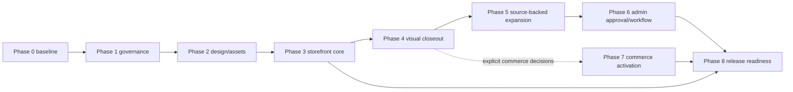
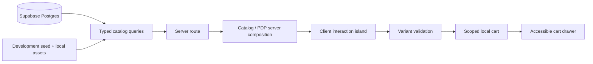
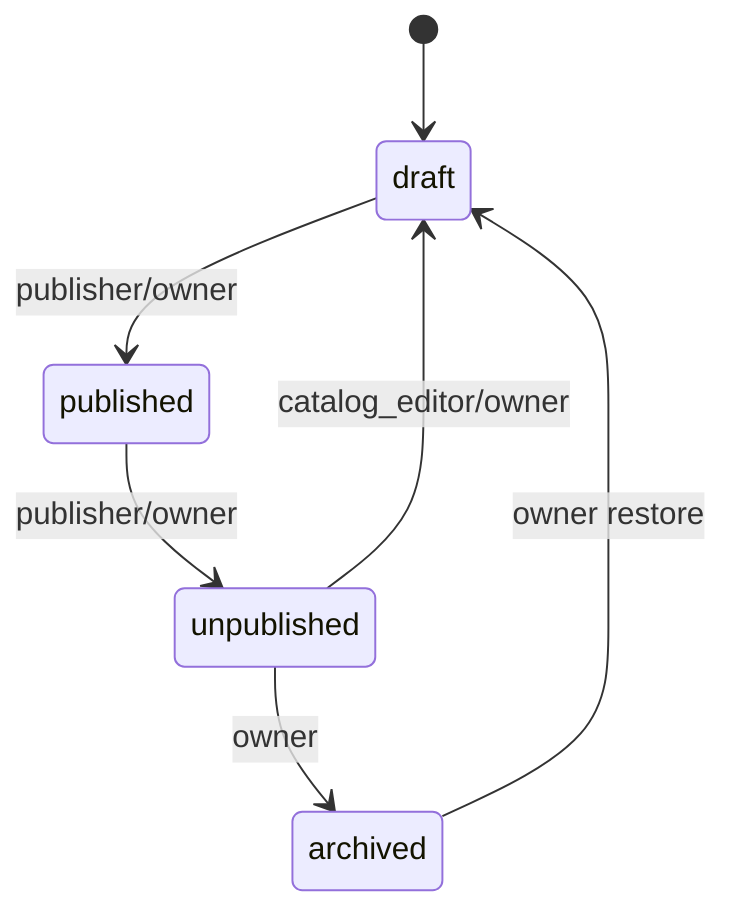

# Delta Gym Wear — Project Graphs

## Delivery phase dependency graph



## Storefront data flow



## Product publishing lifecycle



## Route-to-source coverage

```mermaid
flowchart TD
  F10[Figma frame 10 + card crops] --> Catalog[/ catalog]
  F14[Figma frame 14 + image crops] --> PDP[/products handle]
  F13[Figma frame 13 + cart icons] --> Cart[cart drawer]
  Motion[Circles motion: invalid export] -. blocked .-> Landing[landing]
  Missing[No approved responsive/source evidence] -. blocked .-> Expansion[home/collections/search/policies/admin]
```

## Test and release gates


